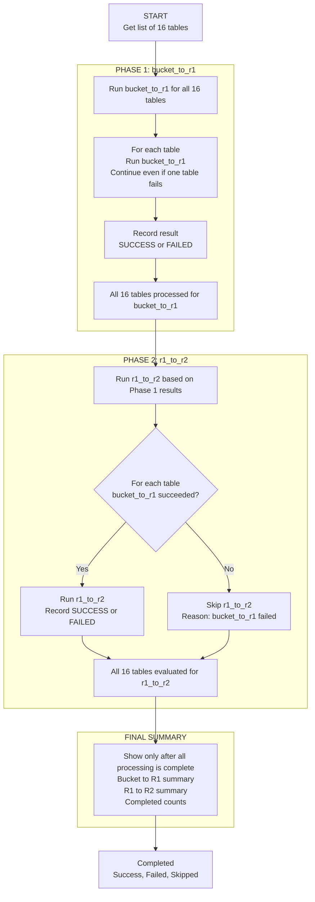

# Local Test Runner

Local orchestration script for testing the full daily flow:

```text
bucket_to_r1
then
r1_to_r2
```

## Script

```text
local_test/run_bucket_to_r1_then_r1_to_r2.py
```

## Run

From the project root:

```powershell
python local_test/run_bucket_to_r1_then_r1_to_r2.py
```

## Flow

```text
Run bucket_to_r1 for all tables
Continue to the next table if one table fails
Run r1_to_r2 for tables where bucket_to_r1 succeeded
Skip r1_to_r2 immediately if bucket_to_r1 failed for that same table
Continue to the next table if r1_to_r2 fails
Print phase summaries and final counts
```

## Flow Diagram



## Skip Rule

If `bucket_to_r1` fails for a table, the script does not run `r1_to_r2` for
that table.

Example:

```text
bucket_to_r1 customer_summary -> FAILED
r1_to_r2 customer_summary     -> SKIPPED
```

Other tables continue normally.

## Output

The script prints:

- Bucket to R1 summary
- R1 to R2 summary
- Final success, failed, and skipped counts

It also logs detailed exception messages for failed tables.

## Notes

- This script runs real loads and real SQL.
- Credentials and table configuration come from `.env`.
- Use this only when you want to test the full pipeline locally.
- For Airflow, use the individual loader functions instead of this local test
  script.
